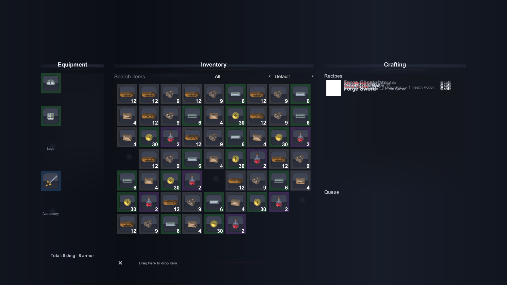

# Tiled Inventory & Crafting System



A **visual-first inventory & crafting system** for Unity. Drag-and-drop recipe editing, a
grid inventory that looks good out of the box, and a crafting UI you ship as-is — no
prefabs to wire, no fonts to import, no third-party packages.

- **Grid inventory** — configurable size, per-slot restrictions, drag to move/merge/swap,
  stacking, equipment slots (head/chest/legs/weapon/accessory), drop-to-destroy.
- **Crafting queue** — craft multiple recipes in sequence, live progress bars, locked
  recipes grayed out with reasons, failure chance, gold/XP/special costs, cooldowns.
- **Visual recipe editor** — a node-graph editor (GraphView) with live preview and
  export to production-ready recipe assets. No JSON, no code.
- **Persistence** — save/load inventory, crafting progress and achievements to local
  JSON slots (autosave included), with a swappable cloud backend interface.
- **Trading & multiplayer plumbing** — player-to-player trade offers and an
  `INetworkBackend` transport abstraction (SyncVault adapter + local simulation).
- **Polish** — rarity color-coding, search/filter/sort, tooltips, procedural audio,
  craft particle bursts, achievements, analytics hooks.

**Everything is built from code at runtime** — `InventoryCraftingUI.BuildUI()` creates the
whole screen (canvas, panels, toolbar, tooltips, drag-and-drop) with no prefab wiring.

## Quick start (under 2 minutes)

1. Open the project in Unity **2022.3 LTS** or **Unity 6**.
2. **Tools → Tiled Inventory → Build Demo Scene**.
3. Open `Assets/DJS.TiledInventoryCrafting/Demo/Demo.unity` → **Play**.
4. Gather wood & ore, smelt, forge the sword, equip it. No config needed.

## What's inside

```
Assets/DJS.TiledInventoryCrafting/
├── Runtime/          systems + UI (TiledInventory.Runtime)
├── Editor/           tools: scene builder, graph editor, validation (TiledInventory.Editor)
├── Demo/             generated demo scene + content assets
└── Documentation~/   full docs (not included in builds)
```

## Feature map

| Area | What you get |
|---|---|
| Inventory | Grid bag (configurable), per-slot restrictions (categories, specific items, locked), equipment grid, drag-and-drop move/merge/swap/equip/drop, Ctrl-drag moves a single item |
| Items | `ItemDefinition` ScriptableObject: name, icon, rarity, category, max stack, equip slot, stats, sell value |
| Crafting | `RecipeDefinition` ScriptableObject: inputs → outputs, craft time, level gate, costs, failure chance, cooldown; sequential queue with cancel + progress bars |
| Recipe editor | Node graph (**Window → Tiled Inventory → Recipe Graph Editor**), live preview, export |
| Persistence | `SaveManager` with swappable backends; local JSON slots, autosave, save-on-quit; queue + cooldowns resume |
| Trading | `TradeSystem`: create offers (offered items reserved), accept/decline/cancel |
| Multiplayer | `INetworkBackend` abstraction, `NetworkCoordinator`, shared crafting stations, inventory sync, `SyncVaultBackend` (HTTPS) + `LocalSimulationBackend` |
| Polish | Rarity color-coding + sorting + search/filter toolbar, hover tooltips, procedural audio, craft particle burst, achievement toasts, analytics events |
| Tooling | Demo scene builder, demo content builder, package validator, edit-mode logic verification, headless screenshot capture |

## Docs

- [Package README](Assets/DJS.TiledInventoryCrafting/Documentation~/README.md)
- [Getting Started](Assets/DJS.TiledInventoryCrafting/Documentation~/GettingStarted.md)
- [API Reference](Assets/DJS.TiledInventoryCrafting/Documentation~/ApiReference.md)
- [Customization](Assets/DJS.TiledInventoryCrafting/Documentation~/Customization.md)
- [Visual Recipe Editor](Assets/DJS.TiledInventoryCrafting/Documentation~/VisualRecipeEditor.md)
- [Persistence](Assets/DJS.TiledInventoryCrafting/Documentation~/Persistence.md)
- [Multiplayer](Assets/DJS.TiledInventoryCrafting/Documentation~/Multiplayer.md)
- [Demo & success criteria](Assets/DJS.TiledInventoryCrafting/Documentation~/Demo.md)
- [Troubleshooting](Assets/DJS.TiledInventoryCrafting/Documentation~/Troubleshooting.md)

## Requirements

- Unity **2022.3 LTS** or **Unity 6 (6000.x)**.
- uGUI only (`com.unity.ugui`) — no TextMeshPro, no Input System, no external packages.

## Verification

The package ships with three edit-mode test suites (no play mode required), all of which
also run headless for CI:

- **Tools → Tiled Inventory → Run Logic Verification** (39 checks)
- **Tools → Tiled Inventory → Verify Recipe Graph** (14 checks)
- **Tools → Tiled Inventory → Validate Package** (demo scene, content, recipes, ids,
  the 5 Wood + 2 Iron → 1 Sword scenario)

See `Assets/DJS.TiledInventoryCrafting/Documentation~/Demo.md` for the full product
success-criteria checklist.
